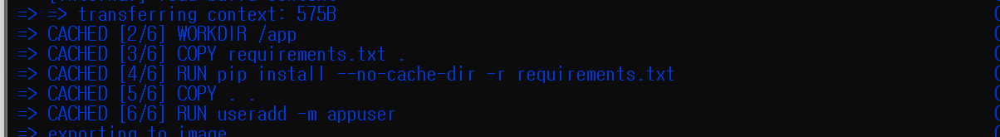
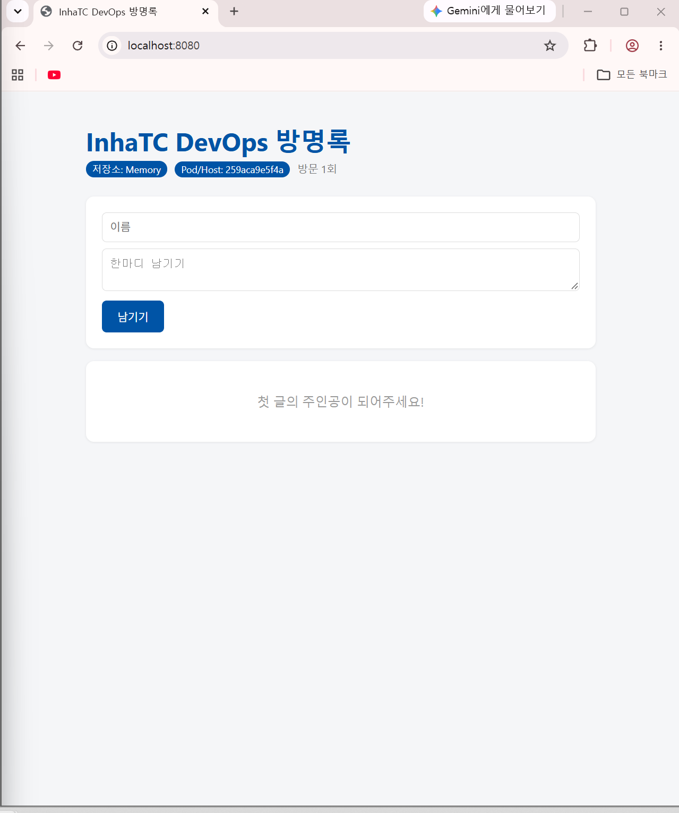
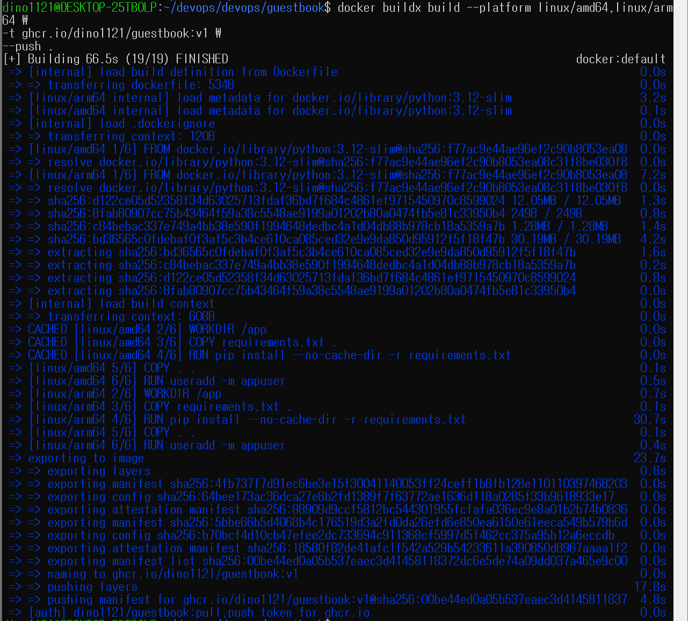
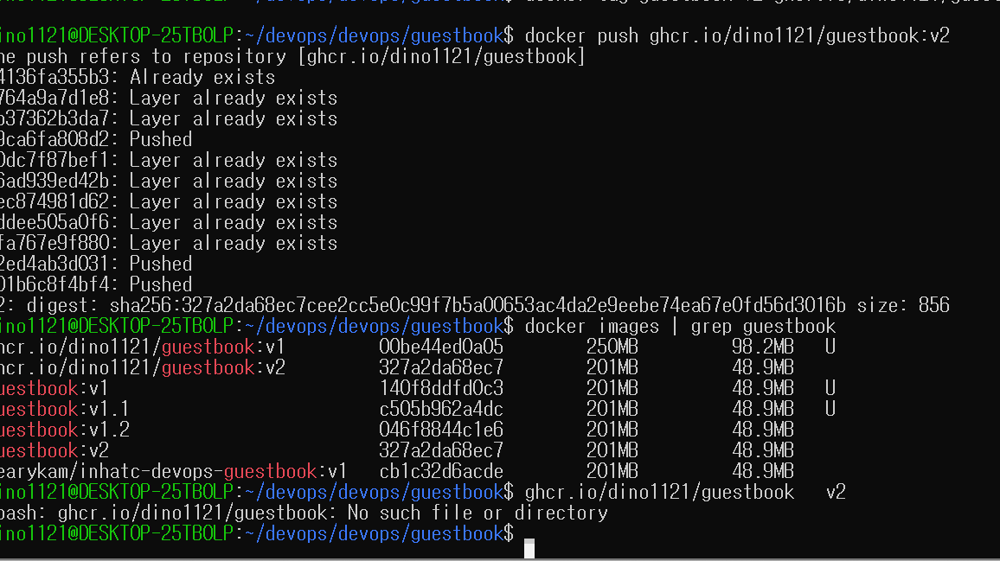
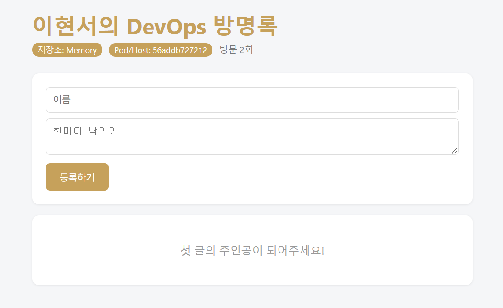
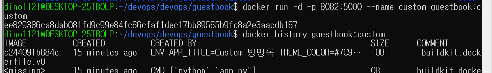
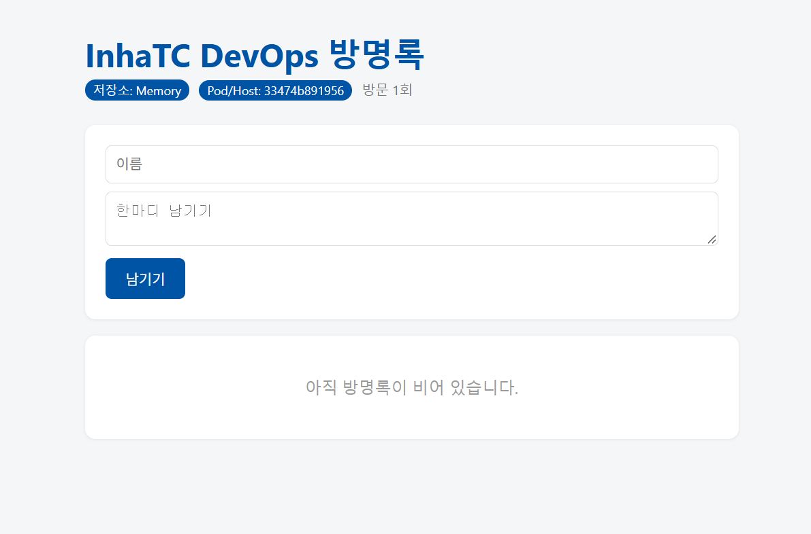

# Week 06 - Dockerfile 실습

## 1. Dockerfile 이미지 빌드

`guestbook` 애플리케이션을 Dockerfile을 이용해 이미지로 빌드하였다.

Dockerfile에서 사용한 주요 명령어는 다음과 같다.

- `FROM`: 기반 이미지를 지정한다.
- `WORKDIR`: 컨테이너 내부의 작업 디렉터리를 지정한다.
- `COPY`: 호스트의 파일을 이미지 내부로 복사한다.
- `RUN`: 이미지를 빌드할 때 명령을 실행한다.
- `USER`: 컨테이너를 실행할 사용자를 지정한다.
- `ENV`: 이미지의 기본 환경 변수를 설정한다.
- `EXPOSE`: 컨테이너에서 사용할 포트 정보를 명시한다.
- `CMD`: 컨테이너가 시작될 때 실행할 명령을 지정한다.

---

## 2. 빌드 캐시 확인

동일한 이미지를 다시 빌드했을 때 변경되지 않은 레이어가 `CACHED`로 표시되는 것을 확인하였다.

`requirements.txt`를 먼저 복사하고 패키지를 설치한 뒤 전체 코드를 복사하면, 코드만 변경되었을 때 기존 패키지 설치 레이어를 재사용할 수 있다.

---

## 3. Guestbook 실행

직접 빌드한 Guestbook 이미지를 컨테이너로 실행하고 `localhost:8080`에서 정상 동작하는 것을 확인하였다.

---

## 4. GHCR 배포 및 멀티 아키텍처 빌드

GitHub Container Registry에 이미지를 Push하였다.

이미지 주소: `ghcr.io/dino1121/guestbook:v1`

`docker buildx`를 이용하여 `linux/amd64`, `linux/arm64`를 지원하는 멀티 아키텍처 이미지를 생성하였다.

사용한 명령:

    docker buildx build --platform linux/amd64,linux/arm64 \
    -t ghcr.io/dino1121/guestbook:v1 \
    --push .

---

## 5. Guestbook V2

Guestbook V2에서는 다음 항목을 수정하였다.

- 제목: `이현서의 DevOps 방명록`
- 테마 색상 변경
- 버튼: `남기기` → `등록하기`
- 빈 방명록 안내 문구 변경

V2 이미지를 빌드한 뒤 GHCR에 Push하였다.

이미지 주소: `ghcr.io/dino1121/guestbook:v2`

---

## 6. 환경 변수 우선순위

V2 이미지를 실행할 때 `docker run -e` 옵션으로 환경 변수를 전달하여 Dockerfile의 `ENV` 값을 덮어쓸 수 있음을 확인하였다.

사용한 명령:

    docker run -d -p 8081:5000 --name gbv2 \
    -e THEME_COLOR="#C6A15B" \
    ghcr.io/dino1121/guestbook:v2

설정의 우선순위는 다음과 같다.

`app.py 기본값 < Dockerfile ENV < docker run -e`

| 설정 방법 | 결정 시점 | 변경 방법 |
|---|---|---|
| app.py 기본값 | 코드 작성 시 | 코드 수정 후 재빌드 |
| Dockerfile ENV | 이미지 빌드 시 | Dockerfile 수정 후 재빌드 |
| docker run -e | 컨테이너 실행 시 | 컨테이너만 다시 실행 |

---

## 7. 기존 이미지를 기반으로 이미지 생성

기존 `guestbook:v1` 이미지를 `FROM`으로 사용하여 새로운 `guestbook:custom` 이미지를 생성하였다.

Dockerfile.custom 내용:

    FROM ghcr.io/dino1121/guestbook:v1

    ENV APP_TITLE="Custom 방명록" \
        THEME_COLOR="#7C9A82"

`docker history`를 통해 기존 이미지 레이어 위에 새로운 `ENV` 레이어가 추가된 것을 확인하였다.

---

## 8. 정리

이번 실습을 통해 다음 내용을 확인하였다.

- Dockerfile을 이용해 실행 환경을 이미지로 정의할 수 있다.
- `RUN`은 이미지 빌드 시 실행되고 `CMD`는 컨테이너 실행 시 실행된다.
- `EXPOSE`는 실제 포트를 여는 명령이 아니라 사용할 포트를 문서화한다.
- Dockerfile 명령 순서에 따라 빌드 캐시 활용 여부가 달라진다.
- 환경 변수는 `app.py 기본값 < Dockerfile ENV < docker run -e` 순서로 우선 적용된다.
- 기존 이미지를 `FROM`으로 사용하여 새로운 이미지를 만들 수 있다.
- `buildx`를 이용하면 여러 CPU 아키텍처를 지원하는 이미지를 만들 수 있다.
- 완성된 이미지는 GHCR에 Push하여 다른 환경에서도 사용할 수 있다.

## 9. 친구 이미지 교환

친구 이미지 대신 교수님이 제공한 이미지를 사용하여 이미지 교환 실습을 진행하였다.

    docker run -d -p 9090:5000 --name friend nearykam/inhatc-devops-guestbook:v1

